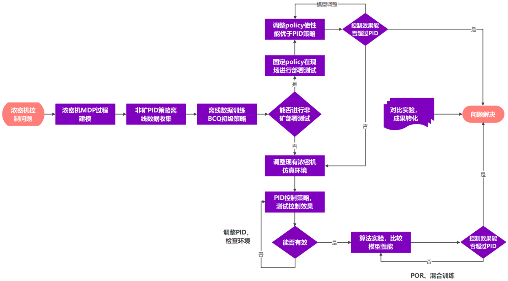

- # 基于离线强化学习的浓密机底流浓度控制
- # 1课题研究背景及意义
	- ## 1.1 课题背景
		- 过程控制、浓密机控制背景简述
	- ## 1.2 国内外研究现状
		- ### 1.2.1 传统控制方法
			- 工业系统建模、pid、MPC
		- ### 1.2.2 工业控制（三个章节，对比实验单独做）
			- 浓密机系统建模
				- 参考袁师兄毕业论文（詹仙园方法也可放进去）
			- model based RL
				- 方法概述
			- 基于离线强化学习的浓密机控制
				- model-based
				- model-free
				- 方法概述
			- 浓密机控制系统（系统开发）
	- ## 1.3 课题目的和意义
		- 使用强化学习方法（现有方法+改进思路）解决浓密机底流浓度控制问题
		- （不写改进思路？）
		- 1 浓密机系统建模
		- 2 浓密机底流浓度控制
		- 3 控制系统开发
- # 2 研究内容与预期目标
	- ## 2.1 研究内容
	- 
		- ### 2.1.1 浓密机马尔科夫决策过程建模
		- ### 2.1.2  基于model-free 的离线强化学习的浓密机底流浓度控制
			- BCQ、CQL
			- 真实环境、仿真环境
		- ### 2.1.3 基于model-based 的离线强化学习的浓密机底流浓度控制
			- 基于CEM的MPC、MOPO
			- 真实环境、仿真环境
	- ## 2.2 预期目标
	- 使用强化学习方法（现有方法+改进思路）解决浓密机底流浓度控制问题
- # 3 创新点
	- 1 浓密机系统建模
	- 2 浓密机底流浓度控制
	- 3 控制系统开发
- # 4 时间安排
- # 参考文献
-
-
-
-
-
- 先建模再强化学习
- 第一部分指导第二部分
	- CEM指导反向优化
	- 自适应动态规划
	- 詹仙园论文，生成训练数据
	- 重点还是在有模型强化学习
	- 作为无模型强化学习的验证模型（还不确定能否可靠）（开题可以放上）
-
- 就把想研究的内容放上。
- 面向充填场景的浓密机设备控制系统
- 紧紧围绕浓密机系统的建模（系统状态、系统特性、输入输出噪声、不确定性、随机性）
	- latent overshooting--时延特性、生成模型多步梯度传递
- 实验数据主要还是thickener
- 应用类论文，算法从底层来描述，很细节的描述
- 算法从头开始讲
-
- 目前还是存在的疑问：
	- 之前在有模型的离线强化学习中把MPC+CEM作为一个点，但是MPC好像只能用作online 的控制，属于online RL方法，这样的话我是直接把课题修改为基于强化学习的还是在探究其它的基于模型的强化学习算法。
-
- 第一章
	- 浓密机原始采样是非均匀的
	- 第二部分MDP是以区间进行状态提取，因为MDP是区间的形式，所以控制是离散的强化学习控制。ODE-RSSM预测一定时间内的数据在进行区间采样。
	- ### 考虑控制周期可变的情况（原始5分钟--7分钟），有一个连续时间的模型，可以靠采样间隔不同，直接获得多种控制周期的模型（数据）
-
- 潜在创新点（创新点可能会从哪产生）：
	- 解决非均匀采样下的连续时间系统辨识问题
	- 实现离线批数据实现控制的方式
-
- [[补全工作]]
-