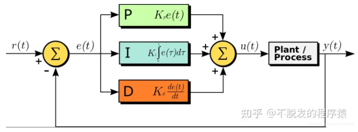
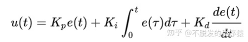

- # PID
	- action_f = solve(out_c_setting, out_c)  bound(120--180)
	- “比例（proportional）、积分（integral）、微分（derivative）”，是一种常见的“保持稳定”控制算法。
	- 
- 
- 
- 先前设置参数：
- ```
  KP = 2
  ki = 0.025
  kd = 0.001
  Base = 160
  BTC = 3
  ```
- 控制系统内相关代码：
- ```
  exp_val_c = float(setPoint)
  error = exp_val_c - now  # 误差
  p_out = self.KP * error  # 比例项
  
  sum_err = self.forget_sum_error(sum_err, dt) + error * dt
  i_out = self.KI * sum_err  # 积分项
  
  derivative = (error - last_err) / dt  # 微分项
  d_out = self.KD * derivative
  
  # 控制输出
  pv_out = p_out + i_out + d_out
  
  # 底流流量和底流浓度的关系：暂时为out_f = 底流流量默认值 + 增益系数*PID变化量
  output = self.root_value - self.BTC * pv_out
  
  output = np.clip(output, last_output-5, last_output+5)
  output = np.clip(output, self.min, self.max)    # bound-[120, 180]
  ```
-
- # Offline RL
- 看代码
- 60小时-冲一礼拜
-
-
-