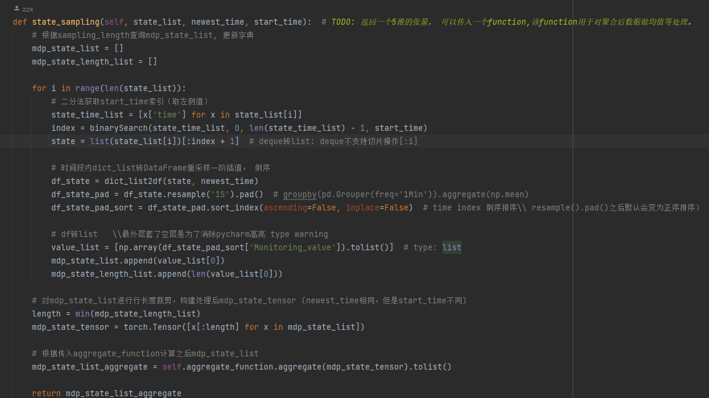

- 控制系统部署后从非矿数据库读出的数据中会有几个参数变为nan,导致mdp状态参数不全，无法进行下一步控制，但是对于dgx同步非矿数据之后的数据库系统又可以正常接收到完整的mdp数据（数据周期不同？dgx是2分钟同步一次，但是非矿的数据是5s更新）
- 解决方案：
	- 修改控制系统sleep时间为2分钟
	- 可能是插值部分存在的问题
		- 
		- 在非矿系统上通过直接log state调试一下（太卡了）