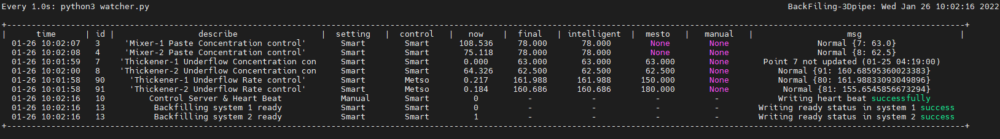
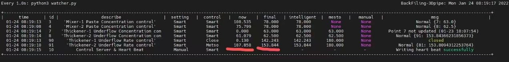
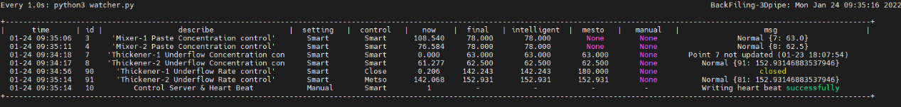

- # 实验内容：
	- 准备工作：连接非矿opc
	- 浓度整体偏低的话，浓度的set_point适当的提高
	- ## pid控制策略
		- 先前测试过的pid控制策略能否长时间开启，再收集一些pid策略下的浓密机数据
		- [[浓密机控制现状沟通-范智]]
	- ## rl控制策略(BCQ)
		- 控制系统中1号（或者2号）浓密机的控制策略改为rl,但是控制器控制模式还为美卓控制，记录控制策略为rl期间智能系统底流流量数据，观察其是否符合预期
	- ## rl控制策略进阶
		- 如果非矿rl没有很好的控制效果（或者没有控制效果），则调试控制系统的thickener仿真，再仿真上查看并提升控制效果
	- ## 压力过大，升耙；
		- 浓密机耙架高度、浓度
		- 越往上压力越小，越往下压力越大
	- ## 水泥添加量控制
- # 工作安排：
	- ## 非矿工作需求：
		- 确认哪台浓密机参与测试
		- 调试非矿opc，让我们的数据库能够正常获取非矿opc数据（跟之前测试时一样就行）
		- 按正常充填流程进行作业，等待浓密机泥层压强、底流浓度到达理想状态。待充填稳定且浓密机底流浓度稳定后，开启DCS系统待测试浓密机底流流量点位的智能控制开关。
		- 尽量可以长时间开启pid策略下的智能控制。
	- ## 北科大工作需求：
		- 实时观察浓密机底流流量及底流浓度变化，确保控制系统运行正常
		- 智能控制模式下浓密机数据收集（mongo）
		- 调试控制系统的控制算法
- # 状态判断
	- 控制监控 watch -n 1 python3 watcher.py
		- ## 控制系统自检
			- 监控最下放两个ready点位，为1时表示改浓密机各控制器准备就绪，可以开启智能控制
				- 
		- ## 浓密机充填状态稳定判断
			- 当now和final差不多一致时，表示充填状态基本稳定，可以让非矿工作人员开启DCS系统智能控制按钮。
				- 
		- ## 智能控制开启判断
			- DCS开启智能控制模式之后，监控内的intelligent 和mesto两个点位的数据应该一致，例如下图91号点位
				- 
		-
- # 控制指标
	- 140	NULL	# 1 Std of Thickener Discharge Concentration	# 1浓密机底流浓度标准差
	  141	NULL	# 2 Std of Thickener Discharge Concentration	# 2浓密机底流浓度标准差
	  142	NULL	# 1 MAE of Thickener Discharge Concentration	# 1浓密机底流浓度MAE
	  143	NULL	# 2 MAE of Thickener Discharge Concentration	# 2浓密机底流浓度MAE
	  144	NULL	# 1 Std of diff Thickener Discharge Concentration	# 1浓密机底流浓度一阶差分标准差
	  145	NULL	# 2 Std of diff Thickener Discharge Concentration	# 2浓密机底流浓度一阶差分标准差
	  146	NULL	# 1 D-value of Thickener Discharge Flow(set value and monitor)	# 1浓密机底流流量监测值设定值均值差
	  147	NULL	# 2 D-value of Thickener Discharge Flow(set value and monitor)	# 2浓密机底流流量监测值设定值均值差